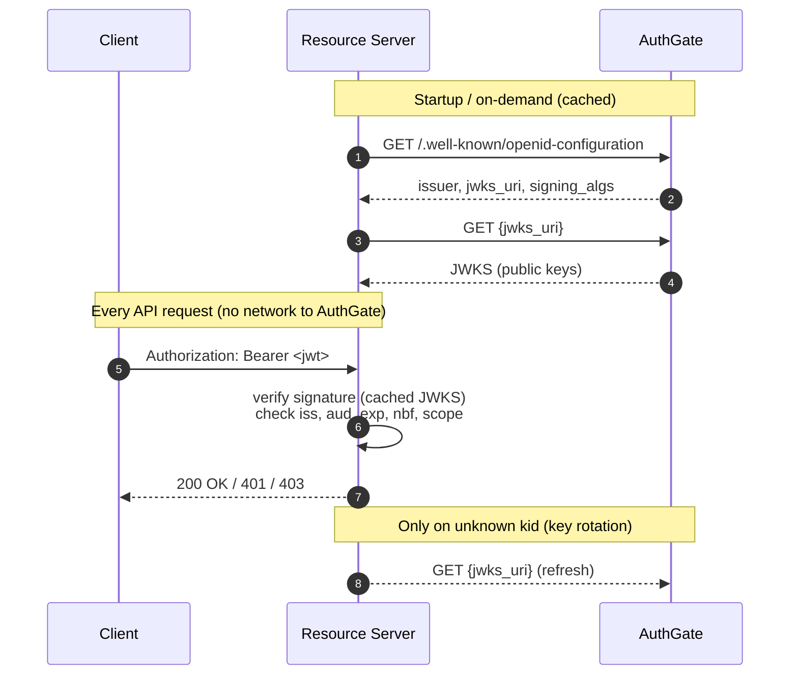

# Go Resource Server — Offline JWKS Validation

Protect HTTP endpoints by validating AuthGate-issued JWT access tokens **offline** using the provider's public keys (JWKS). No callback, introspection, or round-trip to AuthGate per request.

## Flow



## When to Use This vs. Introspection

| Situation                                    | Prefer                                               |
| -------------------------------------------- | ---------------------------------------------------- |
| High RPS, latency-sensitive APIs             | **JWKS (this example)**                              |
| Multi-region / edge / air-gapped deployments | **JWKS (this example)**                              |
| Instant revocation required                  | Introspection ([../go-webservice](../go-webservice)) |
| Opaque (non-JWT) access tokens               | Introspection ([../go-webservice](../go-webservice)) |

With JWKS validation, a revoked token stays valid until its `exp`. Keep access-token lifetimes short (typically 5–15 minutes) and refresh often.

## Prerequisites

- Go 1.25+
- An AuthGate issuer whose `/.well-known/openid-configuration` advertises `jwks_uri` and RS256 (or other asymmetric) signing.

## Environment Variables

| Variable              | Required | Description                                                                                                          |
| --------------------- | -------- | -------------------------------------------------------------------------------------------------------------------- |
| `ISSUER_URL`          | Yes      | AuthGate issuer URL — must match the `iss` claim and the `issuer` field of the discovery document                    |
| `EXPECTED_AUDIENCE`   | \*       | Required value in the `aud` claim. Mandatory unless `SKIP_AUDIENCE_CHECK=1` is set.                                  |
| `SKIP_AUDIENCE_CHECK` | \*       | Set to `1` to explicitly disable `aud` enforcement. Only use for issuers that don't emit `aud` on access tokens.     |

\* Exactly one of `EXPECTED_AUDIENCE` or `SKIP_AUDIENCE_CHECK=1` must be set — the server refuses to start otherwise, so a forgotten audience never silently disables validation.

## Usage

```bash
export ISSUER_URL=https://auth.example.com
export EXPECTED_AUDIENCE=https://api.example.com   # or SKIP_AUDIENCE_CHECK=1
go run main.go
```

Or create a `.env` file in this directory:

```bash
ISSUER_URL=https://auth.example.com
EXPECTED_AUDIENCE=https://api.example.com
# or, for issuers that don't emit `aud` on access tokens:
# SKIP_AUDIENCE_CHECK=1
```

The server listens on port **8088**.

## API Endpoints

| Endpoint           | Auth Required | Scopes  | Description                         |
| ------------------ | ------------- | ------- | ----------------------------------- |
| `GET /api/profile` | Yes           | Any     | Returns subject/client/scope info   |
| `GET /api/data`    | Yes           | `email` | Returns data with access-level info |
| `GET /health`      | No            | —       | Health check                        |

## Testing

### Quick path: `get-token.sh`

A tiny helper that runs the OAuth 2.0 **Client Credentials** grant and prints an access token you can paste into `curl`. Reads `ISSUER_URL` / `CLIENT_ID` / `CLIENT_SECRET` from this directory's `.env` (or the environment). Requires `curl` + `jq`; `--decode` also requires `base64`.

```bash
# Print just the access_token
TOKEN=$(bash get-token.sh)

# ...or see the full token response (useful to inspect `aud`, `scope`, `exp`)
bash get-token.sh --raw

# Decode the JWT header + payload locally (no network)
bash get-token.sh --decode

# Request specific scopes (default is "email profile")
bash get-token.sh --scope "read"

# For a self-signed AuthGate in development:
INSECURE=1 bash get-token.sh
```

`--decode` is handy for confirming what the resource server will actually see — `iss`, `aud`, `exp`, the granted `scope`, and the `kid` that selects the JWKS key.

### Other ways to get a token

- [`../go-cli`](../go-cli) — browser / device-code login (user token, not M2M)
- [`../go-m2m`](../go-m2m) — Go SDK version of client credentials (add `fmt.Println(tok.AccessToken)` after `ts.Token(ctx)` to print it)
- [`../bash-cli`](../bash-cli) — pure-shell device-code flow

### Calling the protected endpoints

```bash
# Any valid token
curl -H "Authorization: Bearer $TOKEN" http://localhost:8088/api/profile

# Requires "email" scope
curl -H "Authorization: Bearer $TOKEN" http://localhost:8088/api/data

# No auth
curl http://localhost:8088/health
```

## How It Works

1. **Discovery** — `oidc.NewProvider` fetches `/.well-known/openid-configuration` and verifies that the returned `issuer` matches `ISSUER_URL`. This defeats attackers who control DNS but not the issuer.
2. **JWKS cache** — `oidc.NewRemoteKeySet` lazily loads the signing keys from `jwks_uri` and automatically refreshes when a token carries an unknown `kid` (key rotation support).
3. **Per-request validation** — fully local, via `provider.Verifier(...)`:
   - RS256 signature against the cached public key (`alg=none` and HMAC-confusion attacks are rejected by the library)
   - `iss` equals `ISSUER_URL`
   - `aud` contains `EXPECTED_AUDIENCE`, or `SKIP_AUDIENCE_CHECK=1` is explicitly set (fail-closed default — the server refuses to start with `aud` validation silently disabled)
   - `exp` is strict; `nbf` has a built-in 5 min leeway
4. **Scope enforcement** — middleware checks the space-delimited `scope` claim; handlers may call `info.hasScope("profile")` for finer-grained checks.
5. **RFC 6750 errors** — `401 invalid_token` / `403 insufficient_scope` responses include a proper `WWW-Authenticate` header.

## Example Responses

**`GET /api/profile`** (valid token):

```json
{
  "subject": "user-uuid-1234",
  "client_id": "your-client-id",
  "audience": ["https://api.example.com"],
  "scope": "email profile",
  "expires": "2026-04-24T12:34:56Z"
}
```

**`GET /api/data`** (valid token with `email` scope):

```json
{
  "message": "You have email-only access",
  "subject": "user-uuid-1234"
}
```

**Missing / invalid token**:

```text
HTTP/1.1 401 Unauthorized
WWW-Authenticate: Bearer error="invalid_token", error_description="invalid token"
```
